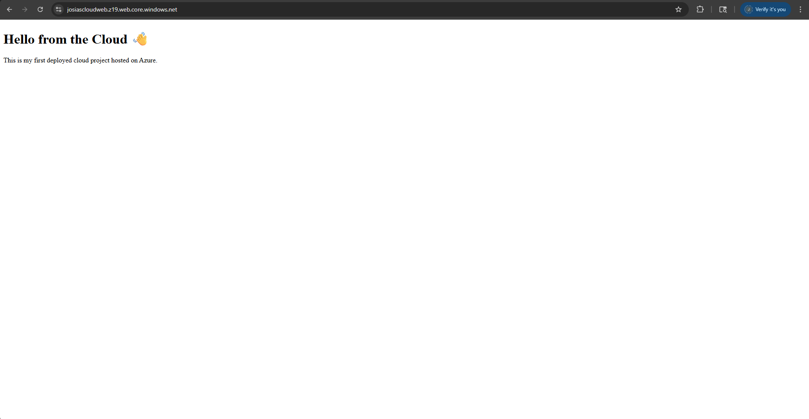

# Azure Static Website Hosting Project

This project demonstrates how to host a static website using **Microsoft Azure Blob Storage**.

## 🌐 Live Demo
Check out the live version here: [https://josiascloudweb.z19.web.core.windows.net/](https://<your-endpoint-url>)

## 🛠️ Tools Used
- **Azure Blob Storage**
- **HTML**
- **Git + GitHub**
- **VS Code**

## 💡 What I Learned
- How to create and configure a Storage Account in Azure
- How to enable and deploy a static site on Azure
- How to use Git for version control and publish projects on GitHub

## 📸 Screenshot

## 🚀 Author
**Josias Ballard**  
Aspiring Cloud Engineer  
📍 Rapid City, SD
